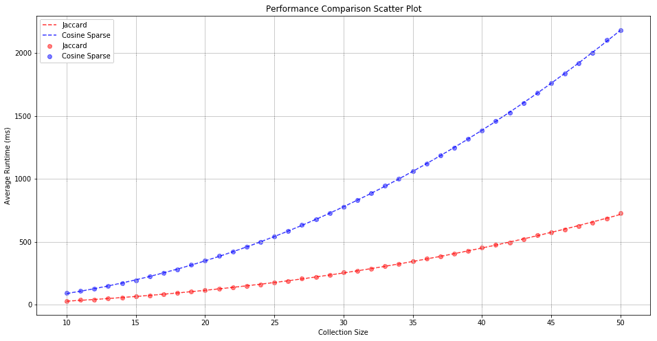
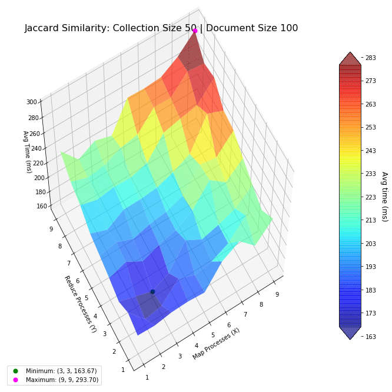
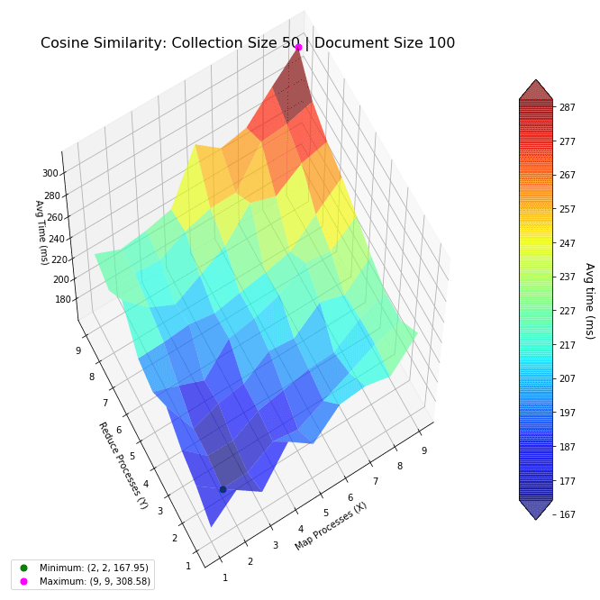
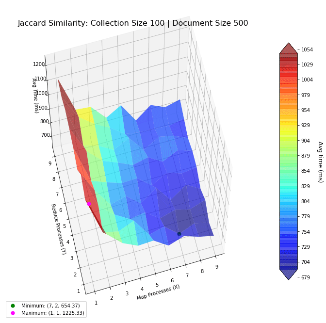
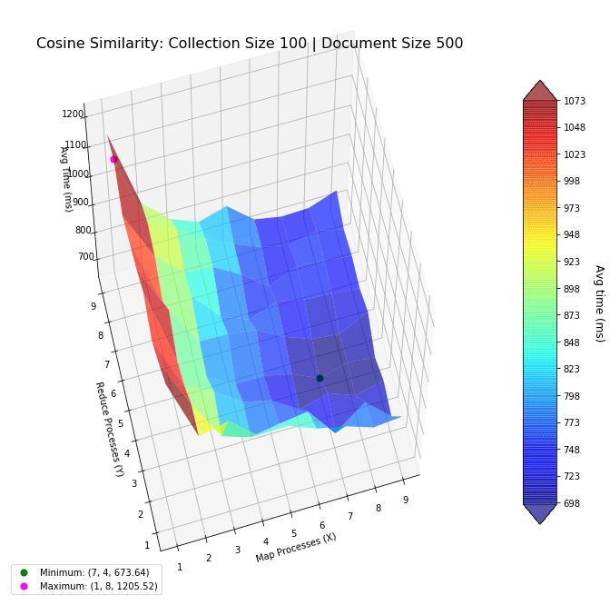

# Map-Reduce Performance Landscape

*This work was performed as part of the 2019 Fall semester, Algorithmic Data Science module (969G5) at the University of Sussex. The assignment was programmed in python, the source code and report can be downloaded from here: [Jupyter Notebook + python (zip file)](https://drive.google.com/uc?export=download&id=1LDVCGTjBMLQndbXATTRAzss2WJBV1Yze)*

---

In this work, a task was given to investigate the computational complexity of the Jaccard similarity measure and the Cosine similarity measure, for computing all-pair similarities of text files. Additionally, the performance of map-reduce paradigm was also investigated.



In the first part, the time complexity of Jaccard and Cosine similarity measures were investigated. 
The result was as expected, while both algorithms had quadratic time complexity (dashed lines), Jaccard similarity is shown to be faster due to its lower coefficients.

Next, I investigate the performance of the two algorithms when using the map-reduce computing paradigm. The goal was to find the most optimal mapper-reducer process count. This can be visualized as a 3D landscape, where I vary the number of processes in the x-y axes, and plot the computation time in the z-axis. We then mark the maxima and minima for reference. The surfaces were colored based on height to help with visibility. 




Based on the above results, using lower numbers of mapper-reducer processes is the most optimal for smaller document collections (50 files, with 100 words per file). 
This shows using more processes actually decrease performance, because of the increased overhead. 

With larger collections, the optimal number of processes increase, and is shown in the next figures. Notice how the performance benefits from more mapper processes, but not more reducer processes, suggesting the bottleneck to be in mapping.




The function for generating these plots are programmed in python and matplotlib.
Coloring in the surface, as well as making them transparent is very useful for visibility reasons, as matplotlib is rather limited in 3D plotting capabilities. The lack of interactivity (when plotting in Jupyter Notebook) also affected the design of the plot.

```python {numberLines}
import matplotlib.pyplot as plt
from mpl_toolkits.mplot3d import Axes3D
from matplotlib import cm

"""
3D plotter for mapper-reducer processes

Data: x,y,z are all vectors of the same length.
This function handles reshaping them automatically.

xstep and ystep is simply xtick and ytick values.
"""
def LandscapePlot (x, y, z, xstep, ystep, **kwargs):
    fig = kwargs.get( 'fig', plt.figure(figsize=kwargs.get('figsize',(12,12))) )
    ax = kwargs.get( 'ax', fig.add_subplot(kwargs.get('subplot',111) , projection='3d') )
    
    X = np.reshape(x, (xstep.size,ystep.size))
    Y = np.reshape(y, (xstep.size,ystep.size))
    Z = np.reshape(z, (xstep.size,ystep.size))
    
    # Plot Surface
    cmap = kwargs.get('cmap',cm.jet)
    surf = ax.plot_surface(X, Y, Z, 
                           rstride=1, cstride=1, cmap=cmap, zorder=1, alpha=kwargs.get('alpha',1),
                           linewidth=1, antialiased=True, shade=True)
    cticks = np.arange(np.floor(np.min(z)), np.ceil(np.max(z)), kwargs.get('ctickstep',10) )
    cbar = fig.colorbar(surf, shrink=kwargs.get('colorbar_shrink',1), aspect=12, ticks=cticks, extend='both')
    cbar.set_label('Avg time (ms)\n', rotation=270, fontsize=12, labelpad=20)
    
    ax.set_xlabel( kwargs.get('xlabel','Map Processes (X)'), fontsize=kwargs.get('xlabel_fontsize',10) )
    ax.set_ylabel( kwargs.get('ylabel','Reduce Processes (Y)'), fontsize=kwargs.get('ylabel_fontsize',10) )
    ax.set_zlabel( kwargs.get('zlabel','Avg Time (ms)'), fontsize=kwargs.get('zlabel_fontsize',10) )
    ax.set_title( kwargs.get('title','Map Reduce'), fontsize=kwargs.get('title_fontsize',10))
    ax.view_init( kwargs.get('view_v',60), 180+kwargs.get('view_h',60))

    plt.xticks(np.arange(1,xstep.size+1))
    plt.yticks(np.arange(1,ystep.size+1))
    
    # Find Minimum
    xmin = x[np.argmin(z)]
    ymin = y[np.argmin(z)]
    zmin = z[np.argmin(z)]
    minLabel = "Minimum: ({0:d}, {1:d}, {2:.2f})".format(xmin, ymin, zmin)
    minPoint = ax.scatter(xmin,ymin,zmin, label=minLabel, color='green', s=50, zorder=10)
    
    # Find Maximum
    xmax = x[np.argmax(z)]
    ymax = y[np.argmax(z)]
    zmax = z[np.argmax(z)]
    maxLabel = "Maximum: ({0:d}, {1:d}, {2:.2f})".format(xmax, ymax, zmax)
    maxPoint = ax.scatter(xmax,ymax,zmax, label=maxLabel, color='fuchsia', s=50, zorder=10)
    
    ax.legend(loc='lower left')
    
    return (fig, ax)
```