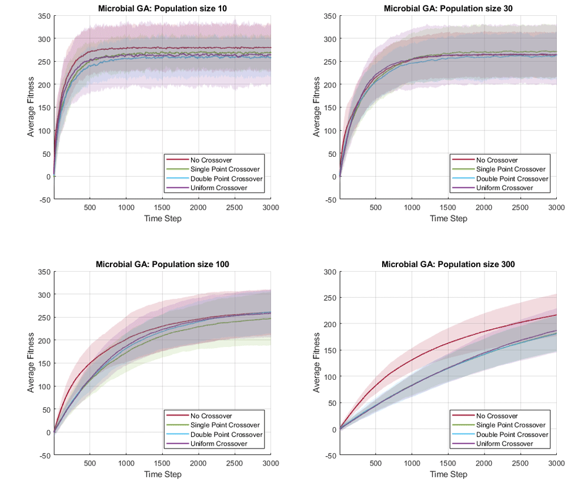
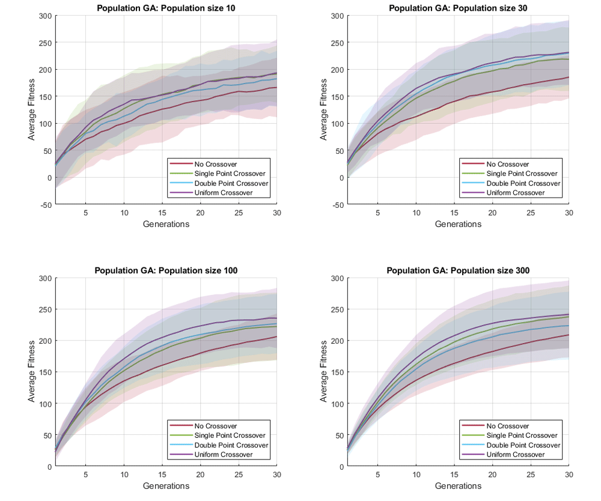

# Investigating Genetic Algorithm Hyperparameters

*This work was performed as part of the 2020 Spring semester, Artificial Life module (819G5) at the University of Sussex. The assignment was programmed in MATLAB, the full report can be downloaded from here: [pdf](https://drive.google.com/uc?export=download&id=1LAa6zQWHLfBN4g4Pt9phOv7A_MgBQKJj)*

---

In this work, I briefly investigate the effects of different crossover operators and hyperparameters in genetic algorithm, on a simple global optimization task. 
Because genetic algorithms are stochastic search algorithms, I need to perform multiple simulations to fairly compare the performance of different settings. This can be visualized by plotting the average fitness overtime, as well as depicting the variance in fitness at each point in time.

We plot the average fitness over time as solid lines, and shade 2 standard deviation from the mean. This allows us to quickly visualize and compare multiple stochastic timeseries data in a single plot. In the following figures, I compare different crossover operators and population size, for two different genetic algorithm variants (microbial GA and population GA).




In MATLAB, a shaded line plot can be drawn using the `js•patch()` function, with the `FaceAlpha` property for transparency. An example script for generating these plot is shown as follow.

```python {numberLines}
figure
% Define color and series name
cmap = ["#A2142F", "#77AC30", "#4DBEEE", "#7E2F8E"];
series = ["No Crossover", "Single Point Crossover", ...
	"Double Point Crossover", "Uniform Crossover"];
for i = 1:SubplotNum
	subplot(2,2,i)
	hold on
	grid on
	xlim([1 timeLimit])
	xlabel('Generations')
	ylabel('Average Fitness')
	title("Population GA")

	% Plot average of average fitness
	% Plot separately from vertices, so legends are grouped together
	for c = 1:crossoverFuncNum
		plot((1:timeLimit), trendMean(i,:,c), 'Color', cmap(c), 'LineWidth', 1.5)
	end
	legend(series, 'Location', 'SouthEast')

	% Patch Vertex: +- 2 standard deviation from mean
	% https://jvoigts.scripts.mit.edu/blog/nice-shaded-plots/
	for c = 1:crossoverFuncNum
		% X-vertex position
		Xvert = [(1:timeLimit), (timeLimit:-1:1)];
		% Y-vertex position
		Yvert = [ (trendMean(i,:,c) + 2.*trendSTD(i,:,c)), ...
			fliplr(trendMean(i,:,c) - 2.*trendSTD(i,:,c)) ];
		% Draw transparent polygons
		patch('XData', Xvert, 'YData', Yvert, ...
		'FaceColor', cmap(c), 'FaceAlpha', 0.15, 'EdgeColor', 'none')
	end
end
```