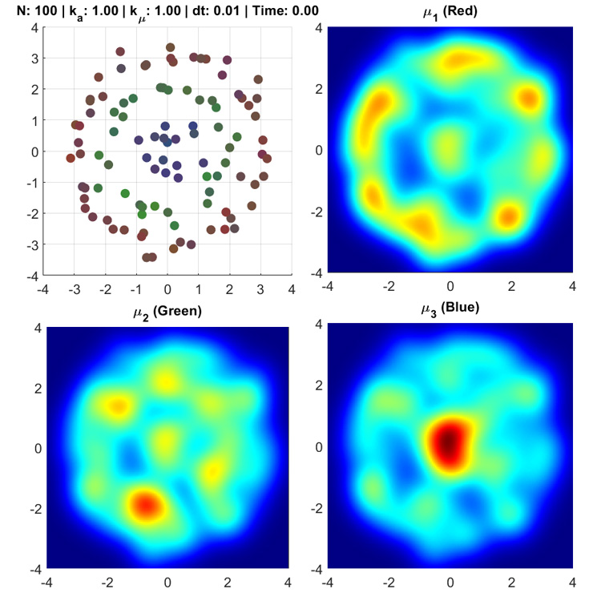
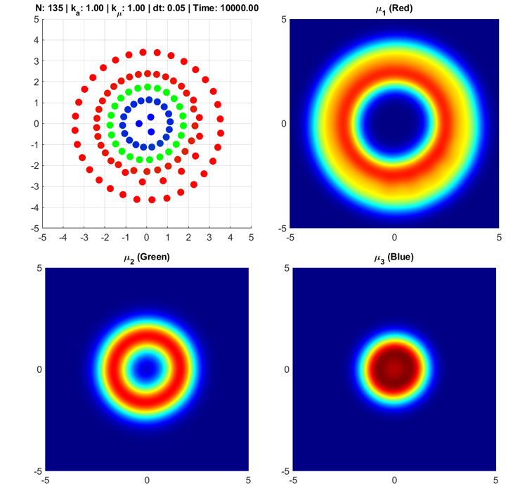

# Free Energy Principle based swarm modelling

*This work was performed as the final dissertation project, for the degree of MSc Intelligent and Adaptive Systems at the University of Sussex, academic year 2019/2020. The project was programmed in MATLAB. 
The source code is provided in the Github repository [github.com/mimocha/fep-swarm](https://github.com/mimocha/fep-swarm), and the full dissertation can be downloaded from here: [pdf](https://drive.google.com/uc?export=download&id=1I8faSJduRKPwK9qPP3D17HGjeFKaGbSm)*

---

This project applies the Free Energy Principle -- a relatively recent neuroscientific theory of cognition and action of living organisms -- to modelling self-organizing swarms. The work is largely based on the paper [*"On Markov blankets and hierarchical self-organisation"*, Palacios et al. (2020)](https://doi.org/10.1016/j.jtbi.2019.110089). I reimplement the model presented by Palacios et al. from scratch, and investigate the possible applications in swarm robotics.

In the model, I simulate a swarm of particle agents, represented as dots in the upper left plot. Each agent holds a belief about the state of the world and tries to fulfill those beliefs by taking action in the world. So each agent may have beliefs about their positions and states in the world, and moves around in the world to fulfill those beliefs. The main hypothesis is that when each individual agent acts accord to this principle, decentralized, self-organizing behaviors can be observed.

Each agent can become one of three "types", and emits a short-range chemical signal based on their type. The three other plots are heatmaps of the signal concentration for each signal types. For a more in-depth explanation, refer to the [Github repository](https://github.com/mimocha/fep-swarm), or to the full paper.

## Simulation Examples:
---

<iframe src='https://gfycat.com/ifr/CheeryResponsibleFrenchbulldog' frameborder='0' scrolling='no' width='100%' height='100%' style='position:absolute;top:0;left:0;' allowfullscreen></iframe>

<iframe src='https://gfycat.com/ifr/AmbitiousDazzlingJay' frameborder='0' scrolling='no' width='100%' height='100%' style='position:absolute;top:0;left:0;' allowfullscreen></iframe>

<iframe src='https://gfycat.com/ifr/ImaginativeDizzyEquestrian' frameborder='0' scrolling='no' width='100%' height='100%' style='position:absolute;top:0;left:0;' allowfullscreen></iframe>

<iframe src='https://gfycat.com/ifr/LankyOrderlyAlbino' frameborder='0' scrolling='no' width='100%' height='100%' style='position:absolute;top:0;left:0;' allowfullscreen></iframe>

<iframe src='https://gfycat.com/ifr/CarefreeVerifiableKingfisher' frameborder='0' scrolling='no' width='100%' height='100%' style='position:absolute;top:0;left:0;' allowfullscreen></iframe>
