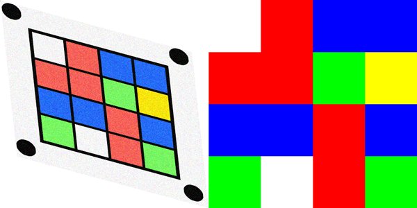
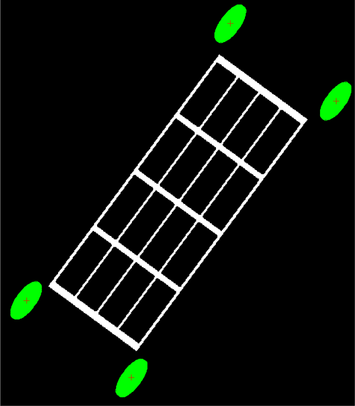
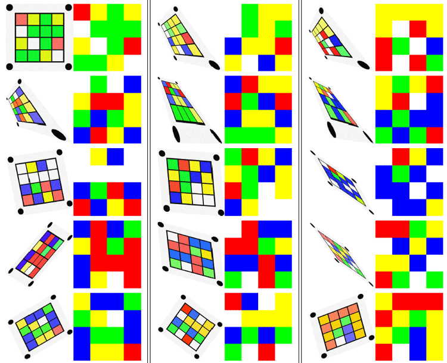

# Identifying Colour Matrices with Image Processing

*This work was performed as part of the 2020 Spring semester, Image Processing module (521H3) at the University of Sussex. The assignment was programmed in MATLAB, the full report can be downloaded from here: [pdf](https://drive.google.com/uc?export=download&id=1qOJrNtUSeddLQpXGM5ntLBSuuZTkjipU)*

---

In this work, a task was given to automatically identify colour matrices on noisy, distorted images, using traditional image processing techniques. An example is shown in the next image, with the input image on the left and output on the right.

The task can be broken down into these steps:

1. Detect the circular markers
2. Calculate and apply 2D transform to fix image distortions
3. Denoise image
4. Identify colour / output results

Markers can be detected by connecting black pixels into "blobs". Black pixels can be selected based on luminosity values (HSV colour space), and connected into neighboring blobs. We know that there are only 4 marker blobs, and a grid blob, so we can select the correct blobs based on their pixel count (grid blobs has more pixels than marker blobs).

</img>

Once the markers are found, we can simply find their center points and calculate some 2D transform to return them to the original undistorted positions.  
Denoising can be done with median filters, and identifying colours can be achieved quite easily based on the hues.

