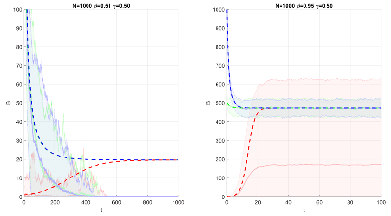

# Comparing Gillespie and Meanfield Simulation

*This work was performed as part of the 2019 Fall semester, Maths & Computational Methods for Complex Systems module (817G5) at the University of Sussex. The assignment was programmed in MATLAB, the report can be downloaded from here: [pdf](https://drive.google.com/uc?export=download&id=1bF6KzecSD82WnC-uIba6SDSkGq5nglHo)*

---

In this work, a task was given to investigate modelling some dynamical system. Part of the task was to investigate the difference between a [Gillespie simulation](https://en.wikipedia.org/wiki/Gillespie_algorithm) and a [meanfield approximation](https://en.wikipedia.org/wiki/Mean-field_theory) of the same system.

Since Gillespie is a stochastic simulation, I simulate each scenario 100 times so I can calculate the average trajectory of the system. This is drawn in the next figure as pale solid lines with shaded area.
The pale solid lines represent the average trajectory for some initial condition, while the shaded are represents 2 standard deviations from the mean.

Meanwhile, the dashed lines are meanfield simulations, calculated with Euler integration. The two are overlayed on top of one another for comparison.
If the two agree, we should expect to see the dashed lines and solid lines of the same colour overlapping. However, this is not the case, showing the disagreement between the two methods.



The code for drawing this plot is in MATLAB. The functions for running the Gillespie simulations and meanfield simulations are not included.

```matlab {numberLines}
% For Q 2.3, Q 2.4
% Function to run multiple Gillespie scenarios, then create shaded plots.
% Uses parallel computing.
function data = GillespieInterpolated2D(GillespieFunc, ax, N, B0List, gamma, R0List, tSeries, sampleSize, stdArea)
    % Keep each scenario in a separate cell array
    % Should be less confusing than simple multidimension array
    data = cell(length(B0List), length(R0List));

    % Scenario Loop
    for j = 1:numel(R0List)
        R0 = R0List(j);
        for i = 1:numel(B0List)
            B0 = B0List(i);
            beta = R0*gamma;
            
            % Use parallel computing to collect data of one scenario
            data{i,j} = GillespieFunc(N, B0, beta, gamma, tSeries, sampleSize);
        end
    end
    
    % Plotting Data
    alpha = 0.7; % Makes plot lighter color
    colorMap = hsv(length(B0List));
    colorMap = colorMap + alpha.*(colorMap == 0);
    for j = 1:numel(R0List)
       for i = 1:numel(B0List)
           ShadedPlot2D(ax, data{i,j}, stdArea, colorMap(i,:))
       end
    end
    
    fprintf('Done')
end

% For Q 2.3
% Function to generate shaded plots.
% Input Data format: [timeData meanData stdData]
% Shaded area is `stdArea` standard deviation away from the meanData.
% Code is largely based on ideas from this blog post:
% https://jvoigts.scripts.mit.edu/blog/nice-shaded-plots/
function ShadedPlot2D(ax, data, stdArea, color)
    % Set to current axis
    axes(ax);
    
    % Remove singleton axis
    data = squeeze(data);
    
    % Plot Mean
    % [timeData meanData stdData]
    plot(data(:,1), data(:,2), ...
        'Color', color(:), 'LineWidth', 2, 'LineStyle', '-', ...
        'HandleVisibility', 'off');
    
    % Shade +- standard deviation area
    % [timeData meanData stdData]
    Xvert = [ data(:,1) ; flipud(    data(:,1))];
    Yvert = [(data(:,2) + stdArea .* data(:,3)) ; ...
       flipud(data(:,2) - stdArea .* data(:,3))];
    % Y-Vertex Lower bound at 0
    Yvert(Yvert < 0) = 0;
    patch('XData', (Xvert), 'YData', Yvert, ...
        'FaceColor', color, 'FaceAlpha', 0.15, ...
        'EdgeColor', color, 'EdgeAlpha', 0.5, ...
        'HandleVisibility', 'off');
end

% For Q 2.3
% For repetitive plot formatting
function Format2D(ax, limitList, labelList)
    axes(ax);
    hold on
    grid on
    
    xlabel(labelList(1))
    ylabel(labelList(2))
    title(labelList(3))
    
    xlim(limitList(1,:))
    ylim(limitList(2,:))
end

% For Q 2.3
% Plots the Mean Field Trajectory of a scenario
function MeanfiedTraj2D(ax, N, B0List, gamma, R0List, tSeries)
    % Set to current axis
    axes(ax);
    
    % Meanfield started at t=1, but gillespie starts at t=0
    % Didn't want to change the meanfield code -- would affect part 1.
    Tend = tSeries(end) + (1-tSeries(1));
    Tstep = tSeries(2) - tSeries(1);
    
    % Color List
    colorMap = hsv(length(B0List));
    
    for j = 1:numel(R0List)
        R0 = R0List(j);
        for i = 1:numel(B0List)
            B0 = B0List(i);
            beta = R0*gamma;
            B = meanfield (N, B0, beta, gamma, Tend, Tstep);
            plot(tSeries, B, 'Color', colorMap(i,:), 'LineWidth', 2, 'LineStyle', '--');
        end
    end
end
```