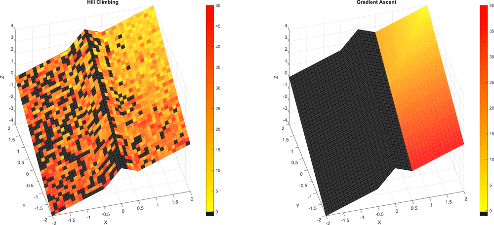

# Hill Climbing vs. Gradient Ascent

*This work was performed as part of the 2019 Fall semester, Maths & Computational Methods for Complex Systems module (817G5) at the University of Sussex. The assignment was programmed in MATLAB, part of the report can be downloaded from here: [pdf](https://drive.google.com/uc?export=download&id=1prDRPIYDS2IHA34oJX6Y1Wm7lq0MCpCs)*

---

This plot shows the difference between the hill climbing and gradient ascent algorithm in a simple global optimization problem. The optimization landscape is colored based on how many iterations it took for the algorithm to arrive at the maxima (top of the plot).
Lighter colours represents lower number of iterations, while black means did not finish.

Half of the landscape for gradient ascent algorithm is black, because the algorithm gets trapped in a local minima (the middle ridge). Meanwhile, the hill climbing algorithm is random, which shows in the plot.