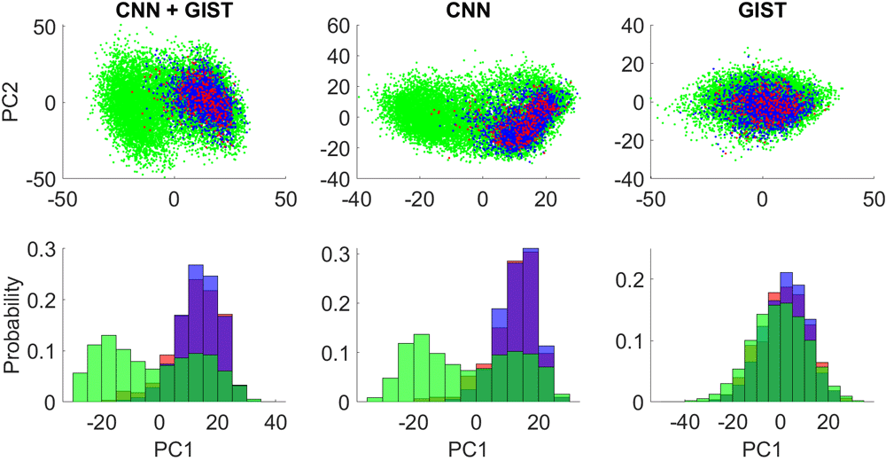
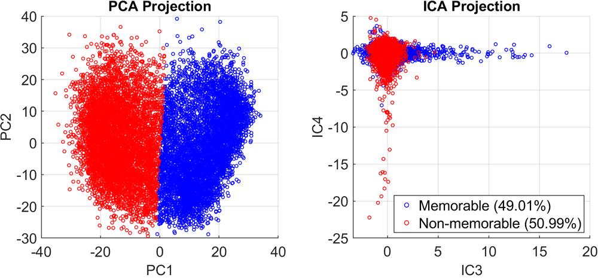

# Principle Components Analysis for Cluster Analysis

*This work was performed as part of the 2020 Spring semester, Machine Learning module (934G5) at the University of Sussex. The assignment was programmed in MATLAB, the full report can be downloaded from here: [pdf](https://drive.google.com/uc?export=download&id=1-oKH7yCj30SqiGetfqWGxA32Hcv27k3R)*

---

In this work, as task was given to classify "memorable" and "non-memorable" images. The dataset itself was in the form of abstract, numerical representations of the images; namely activation values from the [AlexNet](https://en.wikipedia.org/wiki/AlexNet) convolutional neural network, and [GIST descriptors](https://doi.org/10.1023/A:1011139631724). In essence, the dataset was nothing more than incomprehensible numbers, to a human. As a such, I first started from trying to understand the nature of the data I am dealt with.

The approach I took was to perform [principle components analysis (PCA)](https://en.wikipedia.org/wiki/Principal_component_analysis), to reduce the dimensions of the data from 4096 dimensions to three. The resulting projection showed underlying clustering patterns:

It is quite clear that the training labels (red/blue) are poorly separated, and only overlaps with part of the testing data (green). 
Additionally, the GIST descriptors were shown to be a poor indicator of classes.
Interestingly, there seems to be two major clusters within the testing data. I attempted clustering and classification based on this information.

I used simple K-Means clustering on the PCA-projected data, which separated the data into two clusters.
Based on prior informations about the expected ratio of true labels *(there are less memorable images in the test set)*, I was able to infer the correct labels for each cluster based on the relative cluster size.

Because the two clusters in the left figure looked like *slanted* Gaussians, overlapping each other, I thought the angle of the vectors might be a useful metric to classify by. Using [independent components analysis (ICA)](https://en.wikipedia.org/wiki/Independent_component_analysis), I was able to confirm this suspicion, and labels clustered based on PCA largely matched with labels clustered based on ICA.

Based on these findings, I decided to use a [Gaussian Mixture Model](https://en.wikipedia.org/wiki/Mixture_model), as it is a form of clustering which takes into account the angle of the vectors. This model scored 80.7% accuracy in the in-class competition, the top 91st percentile of all submissions. This was quite impressive considering it is an entirely unsupervised approach, requiring very limited compute to train as compared to other top approaches, such as SVMs and linear regression.