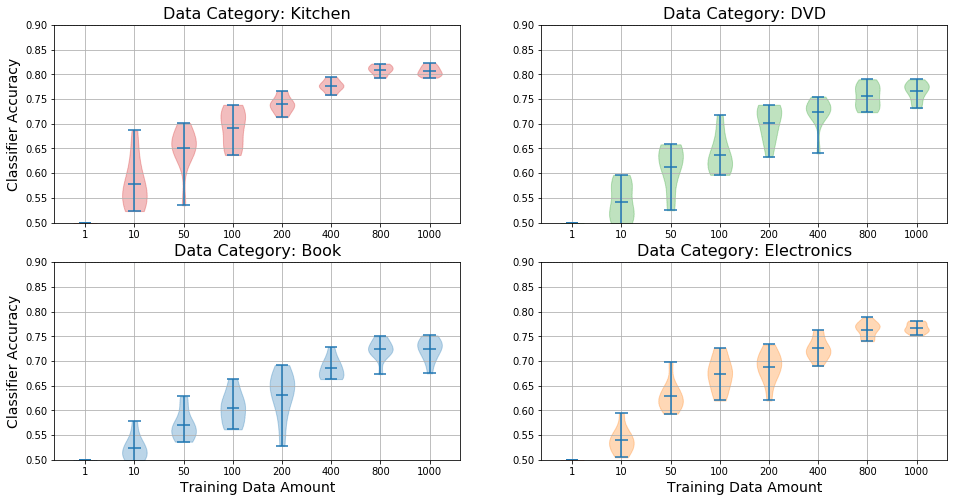
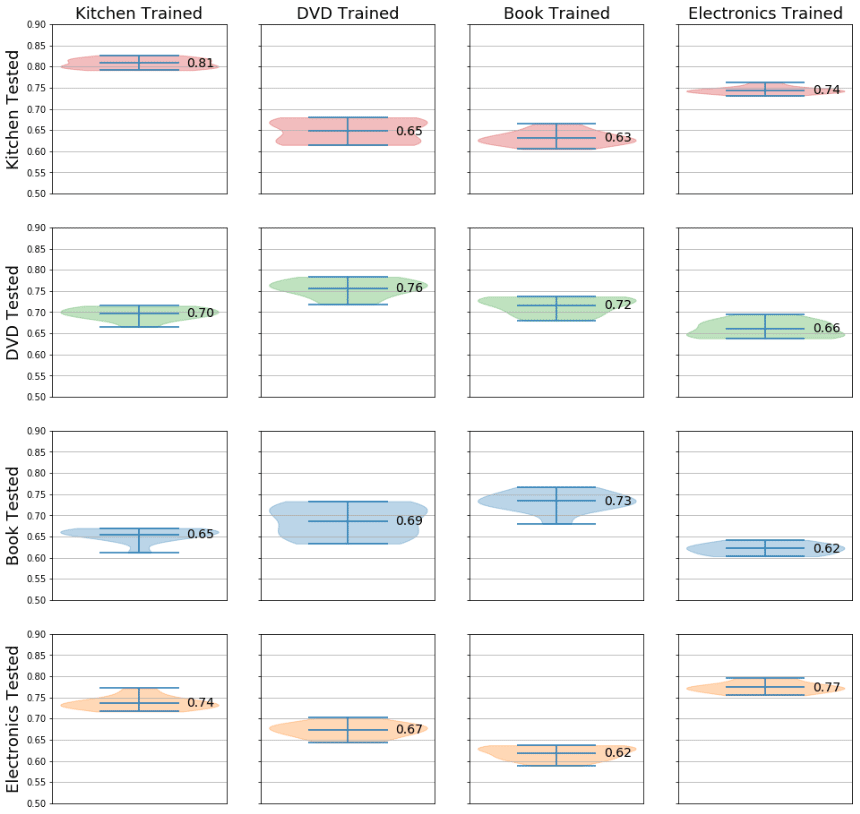
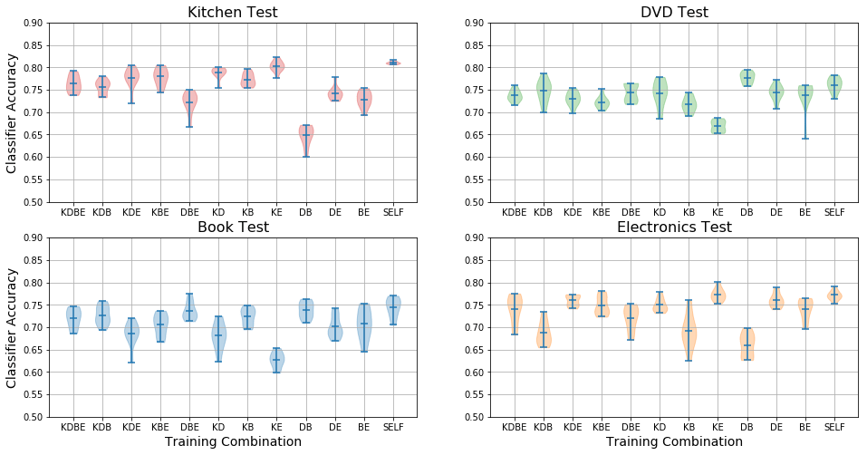

# Effects of Training Data Quantity and Quality

*This work was performed as part of the 2019 Fall semester, Applied Natural Language Processing module (955G5) at the University of Sussex. The assignment was programmed in python, the Jupyter Notebook can be downloaded from here: [Jupyter Notebook](https://drive.google.com/uc?export=download&id=1kYM3y3wWME4WlK2TCgj8fc2K2hjIpF-q)*

---

In this work, the task was given to investigate using Naive Bayes model for sentiment analysis, and investigate how the quantity and quality of training data affected the model's performance. The testing and training datasets are of different categories of product reviews, based on the NLTK library in python.

To test the effect of training data *quantity*, I take repeated measurements of a model's classification performance when varying the amount of training data.
I then visualize the effects by using violin plots, which I believe is superior to the standard box-plots due to the visible distribution. This next figure nicely shows the relationship between increased training data and performance, as well as the diminishing return with larger datasets.



Next I tested how training the classifier on different domain affected the classification performance. It's intuitive to expect that training with related datasets would produce better performance; e.g. training on reviews of kitchen products would transfer better to electronics than books, because they have more in common (kitchen applicances, etc).
This is again visualized using violin plots, organized into pairwise plots.



Finally, I tested how combining the different training data domains affected performance. The amount of training data is made equal for all combinations, only adjusting the ratios between each domain. Generally, performance is best when trained using the same domain, but in some cases a combined dataset performs better than using the same domain.



Here's the code I used for drawing these violin plots:

```python {numberLines}
"""
fig, ax = violin_multiplot (int[c][y][x], int, int, int[y][x])

Plots multiple violin plots.
Data array for this function is in the format: [PLOT_NUMBER][Y-AXIS][X-AXIS]
PLOT_NUMBER is which plot to draw in; raveled like: [[1,2],[3,4]] -> [1,2,3,4]
Y-AXIS is the sample size; all the provided datapoints are used to draw one "violin"
X-AXIS is the "cohort"; len(X-AXIS) > 1 would draw multiple "violins" on a single plot
Made this way, due to how plt.violinplot() works...

-  input : int[][][] : 3D array of data for the violin plot
-  input : int : Number of rows in plot | works with value > 1
-  input : int : Number of columns in plot | works with value > 1
-  input : int[][] : Data color for each plot, can only select the entire plot
- output : matplolib figure
- output : matplotlib axes
"""
import matplotlib.pyplot as plt

def violin_multiplot (data, nrows=2, ncols=2, cmap=None):
    fig_height = 4 * nrows
    fig_width = 16
    
    fig, ax = plt.subplots(nrows=nrows, ncols=ncols, figsize=(fig_width,fig_height))
    plt.rcParams.update({'font.size': 10})
    
    # Color map code: 0, 1, 2, 3
    color_list = ['tab:red', 'tab:green', 'tab:blue', 'tab:orange']
    if (cmap == None): cmap = np.zeros((nrows,ncols))
    
    count = 0
    for i in range(nrows):
        for j in range(ncols):
            # Plots a violin plot for each category
            parts = ax[i,j].violinplot (data[count], showmeans=True, showextrema=True)
            count += 1

            # Sets different color for each plot
            for pc in parts['bodies']:
                pc.set_facecolor(color_list[cmap[i][j]])
                pc.set_edgecolor(color_list[cmap[i][j]])
                
            ax[i,j].grid()
            ax[i,j].set_ylim(0.5,0.9)
            
    return fig, ax
```